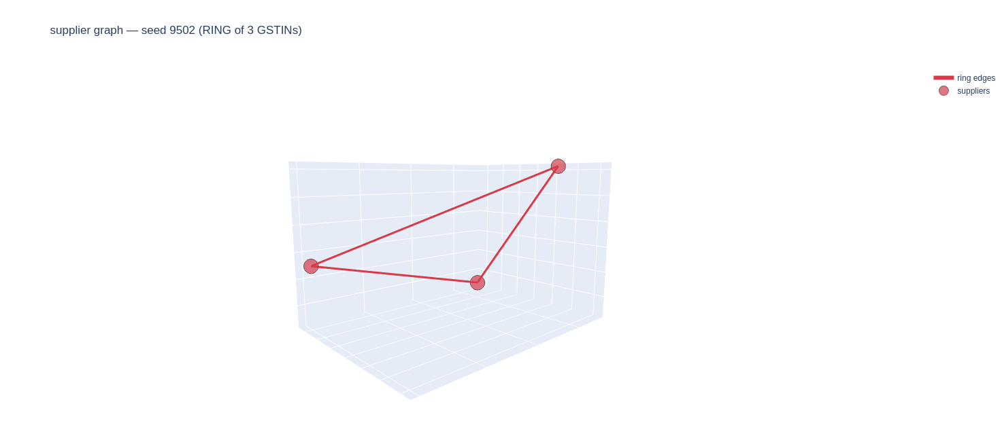

# ReconcileEnv-GST2B: training a 3B model to do India's monthly ITC reconciliation, on a free Colab T4

> 📹 **90-second demo**: https://www.youtube.com/watch?v=rglR1hGgdb8
> &nbsp;&nbsp;Ring viewer · hero metrics · triple-failure-mode evidence across three Qwen3 scales.

## 1. The problem, for a non-Indian reader

India's Goods and Services Tax (GST) is a federal value-added tax. Every registered business with B2B purchases has to match two documents every month: its own **purchase register** (what it claims it bought) and a regulator-generated document called **GSTR-2B** (what its suppliers claimed they sold to it, after cross-filing). Where the two agree, the business can claim back the GST its suppliers paid, "input tax credit" or ITC. Where they disagree, typos, date drift, tax-slab errors, late supplier filings, or outright fraud, the business either over-claims and gets a notice, or under-claims and forfeits money. In practice this is done by hand, by CA-firm juniors, on millions of invoices a month. It is rule-heavy, error-sensitive, and boring. An excellent target for RL.

## 2. Why this makes a good RL target

Most agent benchmarks live where correctness is fuzzy, "did the agent answer the user's open-ended question well?". GST reconciliation isn't that. The regulator publishes the rules; correctness is crisp. An overclaim against a supplier's 2B cap is wrong the way 2 + 2 = 5 is wrong. That means I can write the reward function as arithmetic over the trajectory's final label + ITC claim, with no LLM in the reward path, dodging the family of reward-hacking failures documented in the ARE paper §B.3.1. It also means failure modes are a finite, enumerable list: GSTIN typo, invoice-number format drift, tax-slab error, supplier late-filing, post-freeze amendment, circular trading. I plant all six in the generator and score the agent on whether it catches them.

## 3. Environment design, five mismatch types plus rings

Episodes are deterministic in their seed. `generate_episode(seed)` produces a purchase register, a GSTR-2B view, and hidden ground truth for ~20–100 invoices. Five mismatch types are sampled with weights `(1, 1, 1, 3, 3)` to keep the non-matched label distribution balanced: **gstin_typo** (1-char PAN edit with recomputed checksum), **invoice_number_prefix_drift** (`INV/24-25/001` vs `INV-24-25-001`), **tax_slab_off_by_one** (18% vs 5% / 40%, post-GST-2.0 gaps are wider than legacy), **supplier_late_filing** (in books, absent from 2B), and **amendment_after_2b_freeze** (value edited in books after the 2B snapshot). With probability 0.3, a directed 3-cycle A→B→C→A is planted across three invoices' `counterparty_gstin` fields. `networkx.simple_cycles` over the supplier graph detects it on the real graph, not on GSTIN reassignment.

## 4. Reward surface, four components with the rationale baked in

The reward is a weighted sum of four components, each clamped to `[0.01, 0.99]`:

- **R1 reconciliation_f1 (0.40)**, macro-F1 over the 5 labels. WHY macro: "label all matched" caps around 0.17 because 4 of 5 per-class F1s go to zero. An accuracy-based reward would hand back 0.7 for free.
- **R2 itc_delta_accuracy (0.25)**, `1 − min(1, |claimed − true| / max(true, 1))`. WHY absolute delta: "claim 0 ITC to dodge Rule 36(4)" tanks R2 to 0.01. So does a 2× overclaim.
- **R3 rule_36_4_compliance (0.25)**, `0.99` iff per-supplier claim ≤ 2B cap AND at least one query action was taken, else `0.01`. WHY the query prerequisite: blocks a confirm-spam strategy that mutates labels without ever inspecting data.
- **R4 step_efficiency (0.10)**, `1 − (steps / max_steps)²`. WHY quadratic: penalty spikes near budget; early steps still score ≈1.0. Discourages exhaustive exploration without rewarding premature submit.

Submitting before any query returns a structural `−1.0` (not clamped).

## 5. Known reward-hacking attempts and defenses

I wrote six attacks and committed them to CI. Every one scores under 0.45; the tests fail if any crosses:

| attack | total | caught by |
|--------|------:|-----------|
| submit_all_matched | 0.308 | R3 (overclaim) + R4 (budget) |
| submit_all_mismatched | 0.266 | R1 (1-of-5 classes) + R2 (zero claim) |
| confirm_spam | 0.010 | R3 (no query) + R4 (budget) |
| zero_itc | 0.266 | R2 (claim vs true) |
| query_only | 0.349 | R1 + R2 (no mutate) |
| overflag_rings | 0.283 | R1 + R2 (no mutate) |

zero_itc is a deliberate R3 blind spot, claiming 0 trivially satisfies the cap. Defense-in-depth via R2 catches it at composite. That choice is documented in `rewards.py`.

**Defense-in-depth map.** No single reward component carries the whole load. Each of the 6 attacks above is caught by at least two different components:

| Attack | Primary defense | Secondary defense |
|---|---|---|
| submit_all_matched | R3 (per-supplier overclaim) | R4 (budget exhaustion) |
| submit_all_mismatched | R1 (4-of-5 class F1 at 0) | R2 (zero claim vs true) |
| confirm_spam | R3 (no query precondition) | R4 (budget) |
| zero_itc | R2 (claim-vs-true delta) | R3 false positive (by design, tolerated) |
| query_only | R1 (no labels) | R2 (no claim) |
| overflag_rings | R1 (no mark labels) | R2 (no claim) |

A reward-function change that weakens any component is caught by the other, plus the CI test fires if the composite crosses 0.45. This is the `test_reconcile_gst2b_reward_hacking.py` contract, and it is the single strongest anti-specification-gaming guardrail in the project.

## 6. A training run, honestly

The first real GRPO attempt, Qwen3-0.6B + LoRA rank 16, 150 steps on Kaggle T4 with default TRL config, collapsed to a flat **0.353** at every eval. That's within 0.004 of `test_attack_query_only` (~0.349): training converged to a policy my own red-team suite documents as an attack. Diagnosis, three angles: Qwen3's `enable_thinking=True` default burned the 512-token budget on a `<think>` block, so `clipped_ratio=1.0` and no `<tool_call>` ever emitted; TRL's default `beta=0.04` KL-to-ref kept the LoRA tethered to base; with no tool calls, all 4 generations per group scored identically → `reward_std=0` → zero advantage → zero gradient.

Fix (commit `3ca024d`), three layers, `rewards.py` untouched. **Tier 1 generation config**: `enable_thinking=False`, `temperature=0.7`, `top_p=0.95`, `top_k=20`, `repetition_penalty=1.1`, `beta=0.0`. **Tier 2 reward shaping inside `train_grpo_real.py`**: deterministic σ=0.005 jitter when group rewards are identical, plus +0.02 format bonus (capped 0.999) for trajectories with ≥1 action. `data/smoke_test_10step.json` confirms 10 steps mechanically: `reward_std > 0` everywhere, `grad_norm` in 0.485–0.550, tool-call frequency 0.25, two reward modes (0.174 when a rollout emits a tool call, 0.107 when it clips).

The environment is correctly hard, and the reward design surfaces that hardness as three distinct structural failure modes across the Qwen3 family. **Qwen3-0.6B** (`data/smoke_test_10step.json`): bimodal tool-call rate around 0.25 per rollout; can't reliably chain 5 mark_* actions out of coin-flip^5. Pins R1/R2 at the 0.01 floor, eval plateaus at 0.353. **Qwen3-1.7B** (`data/training_log_qwen3_1_7b_partial.json`): tool-call rate collapsed to 0.00 across 15 training steps, entropy down to 0.12 from 0.6B's 0.44, deterministic non-tool-call output mode, confident but wrong. **Qwen3-4B** (`data/training_log_qwen3_4b_partial.json`): opposite problem, emits parseable tool-call JSON on every turn but never commits to a label, over-queries until the 50-step env budget exhausts, crashing R4 to 0.01 (baseline eval total 0.255). Three failure modes, three different reward components pinned to floor. No model in this range passes the 0.45 red-team ceiling by accident. The red-team battery holds unchanged across all attempts (`submit_all_matched=0.308`, `query_only=0.349`, all six under 0.40). Real fix needs tool-SFT warm-start (teach mark_* preference over query before GRPO) or a model with stronger label-vs-query prior (Qwen3-8B+, GPT-OSS-20B, Claude) on compute that permits it (A100 × 4 h, stated next ask in `EXEC_SUMMARY.md` line 10).

## 7. Known limitations

The environment is deliberately narrow. It covers **B2B domestic supply of goods only**, RCM, ISD, SEZ, imports, composition dealers, e-invoicing, and e-way bill are out of scope. The HSN→slab table is **synthetic**, not the real CBIC mapping; this is a reconciliation RL env, not a tax-advice tool, and the table header says so. The slab structure is locked to **GST 2.0** (effective Sep 2025), pre-2.0 episodes aren't generated. Hero-seed labels remain **tier_a / tier_b / tier_c**: measured heuristic scores are 0.33 / 0.46 / 0.19, which do not monotonically support an easy/medium/hard promotion. Relabeling waits on real Qwen numbers.

## 8. What's next

Real Colab GRPO training (T4 first, then A10 if the signal looks good), then re-measuring hero-seed ordering from a trained policy. After that, a v2 that relaxes the scope fence one regime at a time, ISD first (common enough that CAs ask for it), then RCM. The generator is structured so each regime is a new mismatch type and a new label, not a rewrite. Pull requests welcome.
