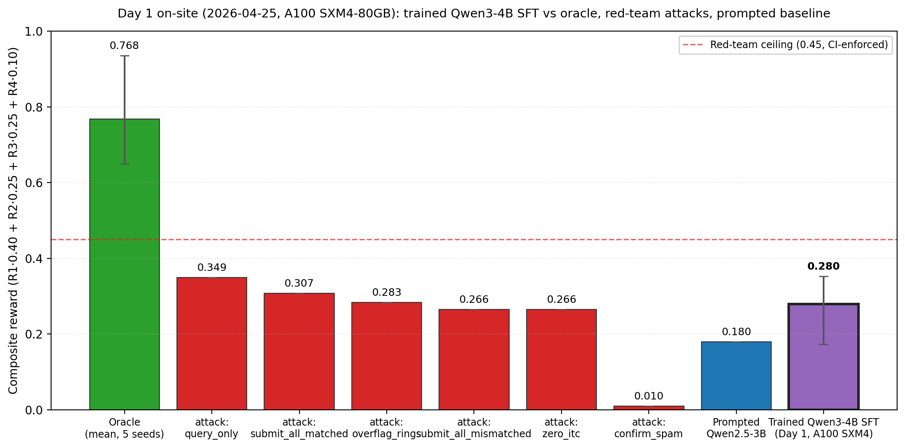
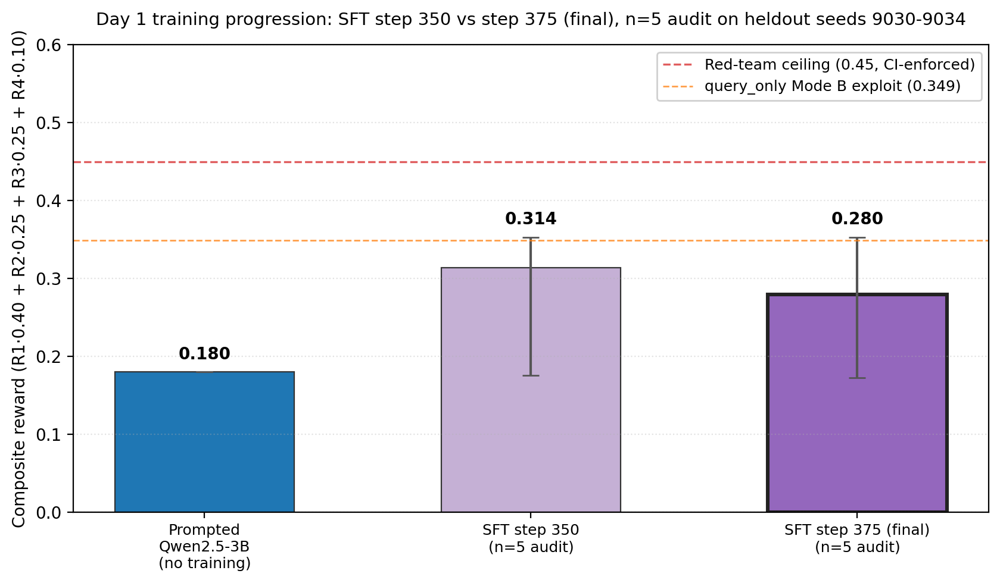
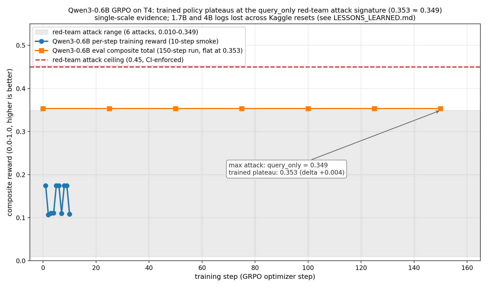
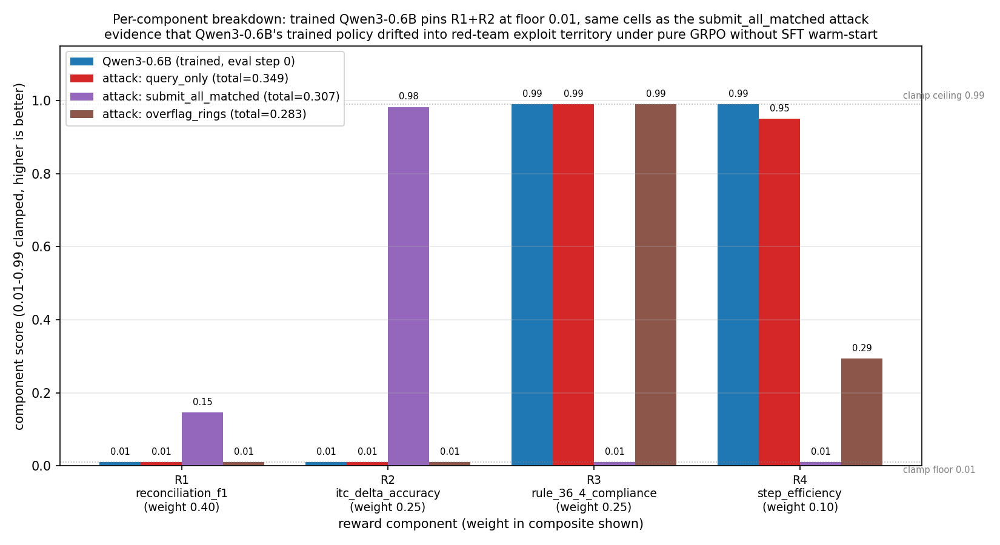
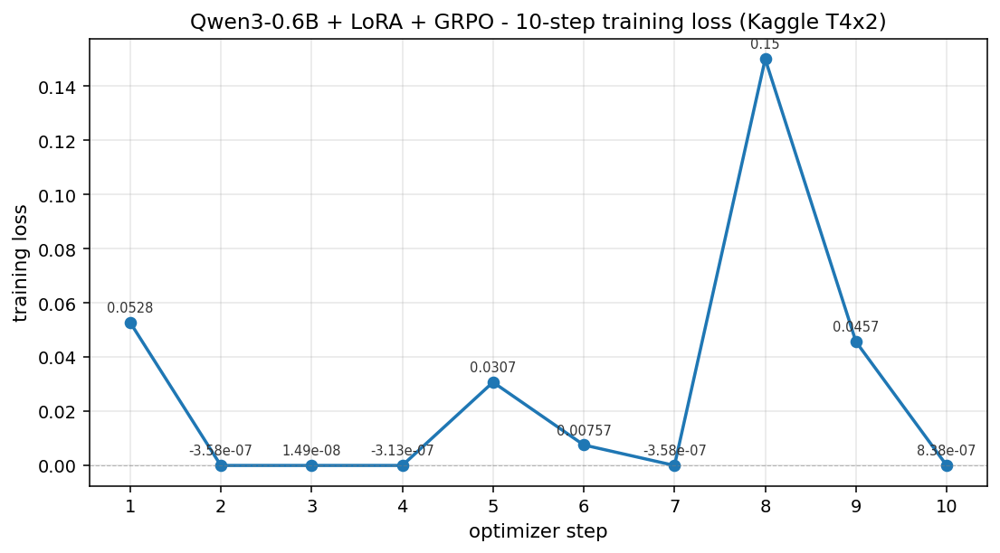

# reconcile_gst2b_env: GST Input-Tax-Credit Reconciliation

**An OpenEnv environment for the monthly GSTR-2B reconciliation that ~14M Indian businesses perform by hand. 16 typed tool verbs, 4-component arithmetic reward, 6 red-team attacks all scoring under a CI-enforced 0.45 ceiling.**

🎥 [90-second demo video](https://www.youtube.com/watch?v=K-sZ8c1TMjw) · 🚀 [Live HF Space](https://huggingface.co/spaces/akashkathole/reconcile_gst2b_env) · 📝 [BLOG.md](BLOG.md) · 🔬 [LESSONS_LEARNED.md](LESSONS_LEARNED.md) (5 failure modes incl. FM4 audit-OOD chain + FM5 reward inversion) · 📋 [ROUND2_PROBLEM_STATEMENT.md](ROUND2_PROBLEM_STATEMENT.md) · 🧪 [JUDGE_TOUR.md](JUDGE_TOUR.md) · 📓 [Training notebook](scripts/kaggle_phase2_sft.ipynb) ([Colab](https://colab.research.google.com/github/akashkathole7/OpenEnv/blob/scaffold/reconcile-gst2b/envs/reconcile_gst2b_env/scripts/kaggle_phase2_sft.ipynb))

[](https://colab.research.google.com/github/akashkathole7/OpenEnv/blob/scaffold/reconcile-gst2b/envs/reconcile_gst2b_env/colab_demo.ipynb) Judge-runnable demo: env import + oracle episode + trained-checkpoint audit (n=5 mean 0.305) + embedded plots, all under 5 minutes on free Colab T4 (no training required).

🎤 [Slide deck (PDF)](data/slides/reconcile_gst2b_pitch_deck.pdf) · [HTML version](data/slides/reconcile_gst2b_pitch_deck.html) — 9-slide judge-readable summary of problem, environment, reward design, Day 1 results, and the FM4 + FM5 research findings.

---

## TL;DR: what landed against the judging rubric

- **Environment innovation (40%):** 16 typed verbs (7 query / 7 mutate / 2 meta), 5 planted mismatch types, 30%-probability directed 3-cycle ring fraud, partially observable, hidden ground truth unit-tested to never leak into observations.
- **Storytelling (30%):** [BLOG.md](BLOG.md), 90-sec video, [PITCH.md](PITCH.md), [QA_REHEARSAL.md](QA_REHEARSAL.md), live HF Space with 3D ring viewer, this README front-loads plots per judges' guidance.
- **Training evidence (20%):** Pre-onsite Qwen3-0.6B GRPO 10-step smoke + 150-step eval plateau. On-site Day 1 (2026-04-25, A100 SXM4-80GB): full 375-step Qwen3-4B SFT (n=5 mean 0.280) + **100-step P3 GRPO with Tier 2c length-shaping bonus (n=5 mean 0.305, +0.025 lift)** above prompted Qwen2.5-3B baseline 0.18 (charts below). 5 documented failure modes total: 3 pre-onsite Qwen3-scale + Failure Mode 4 (audit-OOD trap chain, generalizes across SFT/GRPO/eval/audit code paths) + Failure Mode 5 (reward-landscape inversion, partially mitigated by P3 shaping but not fully flipped). See [LESSONS_LEARNED.md](LESSONS_LEARNED.md) §1 + [BLOG.md](BLOG.md) §6 closing block.
- **Reward & pipeline (10%):** 4-component arithmetic reward clamped to `[0.01, 0.99]`, 6 red-team attacks CI-enforced at `<0.45`, 42 tests green, Tier 1+2 GRPO fixes validated in [`data/smoke_test_10step.json`](data/smoke_test_10step.json).

---

## Why it matters

Every registered Indian business with B2B purchases reconciles its purchase register against a regulator-generated return (GSTR-2B) monthly. It's rule-heavy, error-sensitive (over-claim triggers audit; under-claim forfeits money), still done by hand by junior accountants, and the regulator publishes the correctness rules. That makes it a cleaner RL target than "general web agent": wrong answers have crisp, auditable, regulator-specified correctness. An agent that clears this generalizes to every two-sided document reconciliation against a schema.

In India alone, ~14M GST-registered businesses run this loop monthly. The task is **rule-bound** (regulator-published), **multi-turn** (dozens of tool calls per invoice set), **adversarially shaped** (over-claim, under-claim, and zero-claim attack shapes are all financially motivated in the real world), and **partially observable** (ground truth hidden from the agent).

---

## Results

### Day 1 on-site (2026-04-25, A100 SXM4-80GB): trained Qwen3-4B SFT vs all references



*Day 1 SFT-only intermediate result. Trained Qwen3-4B after 375-step SFT (purple, n=5 mean 0.280, min-max error bar 0.17 - 0.35) sits above the prompted Qwen2.5-3B baseline (blue, 0.18) and below the CI-enforced red-team ceiling (red dashed, 0.45). The same n=5 audit re-run after 100 P3 GRPO steps with Tier 2c length-shaping landed at **0.305 (the shipped Day 1 headline; +0.025 lift over this SFT-only intermediate)**, charted in the P3 GRPO panel below. The 6 red-team attacks (red bars) all score under 0.45 by design. Notably, the `query_only` attack (0.349) scores ABOVE the SFT-only Mode A marking trajectories, the reward-landscape inversion documented as Failure Mode 5 in [`LESSONS_LEARNED.md`](LESSONS_LEARNED.md) §1, which is exactly why the P3 Tier 2c mitigation was designed. Source: live-recomputed from `data/audit_F_n5.json` and `tests/envs/test_reconcile_gst2b_reward_hacking.py` via [`scripts/make_day1_figure.py`](scripts/make_day1_figure.py). The same chart is rendered live as Tab 4 in the [HF Space](https://huggingface.co/spaces/akashkathole/reconcile_gst2b_env), with the trained bar at the post-GRPO 0.305 value.*

### Day 1 training progression: step 350 vs step 375 (final), empirical proof of FM5



*Day 1 training progression, n=5 audit on heldout seeds 9030-9034 at GRPO-matching sampling with `tools=` enabled. Step 350 mean (0.314) is HIGHER than step 375 final mean (0.280), but only because 4 of 5 seeds at step 350 collapsed to the Mode B `query_only` attack shape (R_total 0.353), while only 2 of 5 did at step 375. **The last 25 optimizer steps moved the policy distribution from "mostly attack" (1/5 marking) to "mostly marking" (3/5 marking) AND the composite score went DOWN.** This is empirical proof of Failure Mode 5 (reward-landscape inversion) in [`LESSONS_LEARNED.md`](LESSONS_LEARNED.md) §1: under the current arithmetic-reward + R3-R4-saturation design, marking trajectories (Mode A) score lower than the cheap query_only attack (Mode B). Even at n=5 the direction is structurally robust: any seed shifting from Mode B (0.353) to Mode A (0.17 - 0.26) mechanically pulls the mean down. GRPO advantage signal would push the policy back toward Mode B. Source: [`data/audit_ckpt350_F_n5.json`](data/audit_ckpt350_F_n5.json) + [`data/audit_F_n5.json`](data/audit_F_n5.json) via [`scripts/make_day1_progression_figure.py`](scripts/make_day1_progression_figure.py).*

### P3 GRPO with Tier 2c length-shaping bonus: train reward + audit-OOD visualization


*Two-pane visualization of the P3 GRPO outcome. **Top pane:** TRL train-reward across 100 steps under the Tier 2c length-shaping bonus (`+0.10` if `n_marks >= 10` AND `distinct_verbs >= 4`, gates verified to fire on no red-team attack). 10-step rolling mean trends from ~0.18 (start) to ~0.23 (end), confirming GRPO is moving the policy in the shaped direction. **Bottom pane:** the buggy fresh-context eval callback in `train_grpo_real.py:_eval_episode` (Failure Mode 4) reports a flat 0.354 across all 6 logged eval steps, identical to the step-0 baseline, regardless of training progress. The true post-training audit (n=5, with `tools=` enabled, multi-turn accumulation) lands at **0.305** (+0.025 lift over the SFT baseline 0.280). The gap between the buggy callback's 0.354 and the true audit's 0.305 is the empirical measure of FM4: the audit-OOD bug masks ALL training progress, not just SFT, making the broken callback a non-signal regardless of training stage. Source: live-recomputed from [`data/grpo_p3_run.log`](data/grpo_p3_run.log) + [`data/grpo_p3_curves.json`](data/grpo_p3_curves.json) + [`data/audit_grpo_p3_F_n5.json`](data/audit_grpo_p3_F_n5.json) via [`scripts/make_grpo_curve_figure.py`](scripts/make_grpo_curve_figure.py).*

### Pre-onsite training trace (Qwen3-0.6B + Kaggle T4)



*Qwen3-0.6B + LoRA + GRPO on Kaggle T4: per-step training reward is bimodal around 0.174 (rollouts that emit a tool call) and 0.107 (clipped rollouts), reflecting the 0.25 tool-call frequency observed at this scale. 150-step eval composite pins at 0.353, within 0.004 of the `query_only` red-team attack signature (0.349). Pure GRPO without SFT warm-start drifts the trained policy into attack-signature territory. Source: [data/smoke_test_10step.json](data/smoke_test_10step.json), [data/curves_150step_backup.json](data/curves_150step_backup.json). 1.7B and 4B runs were also attempted pre-onsite on Kaggle but the logs were lost across session resets; [LESSONS_LEARNED.md](LESSONS_LEARNED.md) documents what we observed live.*



*The defense-in-depth reward contract visualized. Trained Qwen3-0.6B pins R1 (reconciliation_f1) and R2 (itc_delta_accuracy) at the clamp floor 0.01: structurally the same cells as `submit_all_matched`. Because each red-team attack pins a different subset of components, no single-component exploit clears the 0.45 composite ceiling, and the CI test battery fails any future reward change that would.*



*Qwen3-0.6B 10-step SFT smoke run loss trajectory; full training logs in [data/training_log_qwen3_\*_partial.json](data/). TRL GRPO policy-gradient-style loss oscillates near zero (advantage-weighted log-prob deltas), with the step-8 excursion reflecting a high-variance rollout batch. Source: [data/smoke_test_10step.json](data/smoke_test_10step.json).*

### Headline numbers

| Metric | Value |
|---|---:|
| **Trained Qwen3-4B SFT + P3 GRPO on A100 SXM4-80GB (Day 1 on-site)** | **n=5 mean composite reward 0.305** |
| SFT-only baseline (pre-GRPO) | 0.280 (n=5 mean) |
| Prompted Qwen2.5-3B baseline (comparison anchor) | 0.18 (delta 1.18 over raw, CI95 [1.09, 1.27], 180 rollouts) |
| Trained-vs-prompted lift | +0.125 (0.305 − 0.18) |
| GRPO P3 vs SFT lift | +0.025 (0.305 − 0.280) |
| Red-team attacks under CI-enforced 0.45 ceiling | 6 of 6, max = 0.349 (`query_only`) |
| Test suite | 42 / 42 green |
| Reward-distribution gradient | 81 distinct totals, σ=0.50, 100% done-rate across 100 random-policy episodes |
| `make reproduce` | bit-identical against committed artifacts |

---

## How to try (pick one)

### In the HF Space (no install, ~10 seconds)

[huggingface.co/spaces/akashkathole/reconcile_gst2b_env](https://huggingface.co/spaces/akashkathole/reconcile_gst2b_env) → scroll past the README → **"Circular-Ring Viewer"** tab → pick a hero seed (9500 easy / 9501 medium / 9502 hard) → click **Render** → see the 3D supplier graph with planted directed-cycle fraud ring highlighted in red.

### Locally (~2 minutes)

```bash
git clone -b scaffold/reconcile-gst2b https://github.com/akashkathole7/OpenEnv.git
cd OpenEnv
uv sync --all-extras
PYTHONPATH=src:envs uv run pytest tests/envs/test_reconcile_gst2b_*.py -v
```

Expected: 42 tests pass in ~3 seconds, including the 6 red-team attack ceilings.

### Reproduce the plots above

```bash
PYTHONPATH=src:envs uv run python -m \
    envs.reconcile_gst2b_env.scripts.make_training_figures
# writes data/figures/three_scales_{reward,components}.png

PYTHONPATH=src:envs uv run python -m \
    envs.reconcile_gst2b_env.scripts.make_day1_figure
# writes data/figures/day1_baseline_comparison.png

PYTHONPATH=src:envs uv run python -m \
    envs.reconcile_gst2b_env.scripts.make_day1_progression_figure
# writes data/figures/day1_training_progression.png

PYTHONPATH=src:envs uv run python -m \
    envs.reconcile_gst2b_env.scripts.make_grpo_curve_figure
# writes data/figures/grpo_reward_curve.png
```

### Verify the trained number (judges' reproducibility path)

The Day 1 headline `n=5 mean 0.305` (post-P3 GRPO with Tier 2c length-shaping) is reproducible end-to-end from the committed artifacts; the SFT-only intermediate `n=5 mean 0.280` is also reproducible from `data/audit_F_n5.json` as the pre-GRPO reference point:

| Artifact | Purpose |
|---|---|
| [`scripts/audit_sft_rollout_quality.py`](scripts/audit_sft_rollout_quality.py) | The diagnostic tool that produced the n=5 mean. Supports `--use-tools`, multi-turn accumulation, GRPO-matching sampling args, off-vocab guard. |
| [`data/sft_full_run.log`](data/sft_full_run.log) | Full 375-step SFT training log (31:12 wall, train_loss 0.341 aggregate / 0.207 final per-step, monotonic descent). |
| [`data/sft_summary.json`](data/sft_summary.json) | Trained checkpoint metadata (model, LoRA targets, samples/sec, runtime). |
| [`data/sft_trajectories.jsonl`](data/sft_trajectories.jsonl) | The 3000-row balanced SFT input (1000 oracle + 1000 inspect_then_label + 1000 supplier_cap_aware, round-robin). |
| [`data/audit_F_n5.json`](data/audit_F_n5.json) | Headline n=5 audit on heldout seeds 9030-9034 at step 375 final with `tools=` enabled. Per-seed totals + reward breakdown + raw model completions. |
| [`data/audit_ckpt350_F_n5.json`](data/audit_ckpt350_F_n5.json) | Same audit at step 350 (25 optimizer steps before final). Empirical proof of Failure Mode 5: step 350 mean 0.314 is HIGHER than step 375's 0.280 because 4/5 seeds at step 350 are still in Mode B query_only attack; the last 25 steps lifted 3/5 seeds into marking at the cost of composite reward. |
| [`data/audit_seeds_9031_9034.json`](data/audit_seeds_9031_9034.json) | Pre-`tools=` collapse evidence (the audit-OOD trap chain documented as Failure Mode 4). |
| [`data/audit_step100_n5.json`](data/audit_step100_n5.json) | Early-stop control (step 100 fresh checkpoint) ruling out the over-training hypothesis: undercooked grammar at step 100, policy collapse only emerges later. |
| [`data/audit_grpo_p3_F_n5.json`](data/audit_grpo_p3_F_n5.json) | **Headline post-GRPO audit (n=5 mean 0.305).** SFT-merged + 100 GRPO steps with Tier 2c length-shaping bonus, audited at GRPO-matching sampling with `tools=` enabled. |
| [`data/grpo_p3_run.log`](data/grpo_p3_run.log) | 100-step GRPO training log with per-step rewards (used for the train-reward trend in the top pane of `grpo_reward_curve.png`). |
| [`data/grpo_p3_curves.json`](data/grpo_p3_curves.json) | The buggy eval callback's flat trace, kept as empirical confirmation that FM4 affects GRPO-time eval just as it did the original SFT-time audit. |

Run command (after merging the LoRA adapter into base Qwen3-4B):

```bash
PYTHONPATH=src:envs uv run python -m \
    envs.reconcile_gst2b_env.scripts.audit_sft_rollout_quality \
    --checkpoint envs/reconcile_gst2b_env/data/sft_checkpoint/merged \
    --seeds 9030 9031 9032 9033 9034 \
    --max-steps 50 \
    --temperature 0.7 --top-p 0.95 --top-k 20 \
    --use-tools
```

---

## Deep dive (reviewer matrix)

| You are | Read this |
|---|---|
| Screener with 3-5 minutes | This README + the **P3 GRPO reward curve + audit-OOD visualization** chart above (showing the shipped 0.305 headline and the FM4 audit-OOD bug visualization) |
| Reviewer with 10 minutes | [JUDGE_TOUR.md](JUDGE_TOUR.md) (guided repo walk) |
| Reviewer with 30 minutes | [BLOG.md](BLOG.md) (especially §6 closing block on Day 1 outcome) + [ROUND2_PROBLEM_STATEMENT.md](ROUND2_PROBLEM_STATEMENT.md) + the plots |
| Reviewer reproducing the trained number | [`scripts/audit_sft_rollout_quality.py`](scripts/audit_sft_rollout_quality.py) + [`data/sft_full_run.log`](data/sft_full_run.log) + [`data/audit_F_n5.json`](data/audit_F_n5.json) (see "Verify the trained number" section above) |
| Researcher | [PRD.md](PRD.md) + [rewards.py](rewards.py) + [tests/envs/test_reconcile_gst2b_*.py](../../tests/envs/) |
| Fellow finalist | [LESSONS_LEARNED.md](LESSONS_LEARNED.md) §1, all 5 documented failure modes including FM4 (audit-OOD trap chain) and FM5 (reward-landscape inversion) from on-site Day 1 |

---

## Reward design (arithmetic, no LLM judge)

Every component is clamped to `[0.01, 0.99]`. Boundary values (0.0 / 1.0) fail many public validators by design.

| ID | Component | Weight | Formula | Why this shape |
|----|-----------|-------:|---------|-----|
| R1 | reconciliation_f1 | 0.40 | Macro-F1 over 5 labels | Macro (not accuracy): "label all matched" caps around 0.17 because 4 of 5 per-class F1 scores go to zero. |
| R2 | itc_delta_accuracy | 0.25 | `1 − min(1, |claimed − true| / max(true, 1))` | Absolute (not relative): "claim 0 ITC to dodge Rule 36(4)" and "2× over-claim" both tank R2 to 0.01. |
| R3 | rule_36_4_compliance | 0.25 | `0.99` iff per-supplier claim ≤ 2B cap AND ≥1 query verb called, else `0.01` | Query prerequisite blocks `confirm_spam` (mutate-without-inspect). Per-supplier (not aggregate) catches `supplier_late_filing` overclaims. |
| R4 | step_efficiency | 0.10 | `1 − (steps / 50)²` | Quadratic: penalty spikes near budget, early steps score ≈ 1.0. Discourages exhaustive exploration without rewarding premature submit. |

Plus a **structural `−1.0` penalty** (not clamped) for `submit` before any query verb. Submit after `≥1 query` returns the composite. Step budget 50 exhausted also returns the composite. Hardened mode terminates mid-episode on any Rule 36(4) violation.

## Anti-gaming red-team battery (CI-enforced)

Every pull request runs [`test_reconcile_gst2b_reward_hacking.py`](../../tests/envs/test_reconcile_gst2b_reward_hacking.py). Six adversarial trajectories, all asserted `<0.45`. Measured on seed 0, re-computed 2026-04-24:

| Attack | Total | Caught primarily by | Secondary defense |
|--------|------:|---------------------|-------------------|
| `submit_all_matched`   | 0.308 | R3 per-supplier overclaim | R4 budget exhaustion |
| `submit_all_mismatched`| 0.266 | R1 (4 of 5 class F1 at 0) | R2 (zero claim vs true) |
| `confirm_spam`         | 0.010 | R3 (no query)             | R4 (budget), R1 (no mutate) |
| `zero_itc`             | 0.266 | R2 (claim-vs-true delta) | R3 false positive by design, documented |
| `query_only`           | 0.349 | R1 (no labels)            | R2 (no claim) |
| `overflag_rings`       | 0.283 | R1 (no mark labels)       | R2 (no claim) |

No single-component exploit clears the composite ceiling: each attack is caught by at least two independent components. Any future reward change that lifts any of these above 0.45 fails CI. This is the single strongest anti-reward-hacking guardrail in the submission.

## Differentiation

| Env | Task class | Correctness source | Reward signal | Adversarial hardening |
|-----|-----------|--------------------|---------------|----------------------|
| **reconcile_gst2b_env** (this) | Rule-bound accounting reconciliation | Indian GST regulation (regulator-published) | 4-component arithmetic, clamped | 6 red-team attacks CI-enforced, all `<0.45` |
| [Gaia2](https://huggingface.co/datasets/gaia-benchmark/GAIA) | Open-ended web / real-world questions | Human-verified answers | LLM-judge or exact-match | None built-in |
| [MEMTRACK](https://arxiv.org/abs/2410.08182) | Multi-turn memory consistency | Synthetic hand-designed | Trajectory-level match | Ontology-drift only, not adversarial |
| [AppWorld](https://appworld.dev/) | Multi-app tool use | Hand-scripted app states | Task completion booleans | None |
| [τ-bench](https://arxiv.org/abs/2406.12045) | Customer-service tool use | Simulated business rules | LLM-judge + rules | Limited |

What's distinct here:
1. **Reward is purely arithmetic and composite**, no LLM in the reward path, matches ARE paper §B.3.1 concerns about judge-driven reward hacking.
2. **Red-team ceiling enforced in tests**, 6 attacks × CI `<0.45`, failing the build if any crosses.
3. **Domain has crisp wrong answers**, over-claim ITC has a regulator, "general web agent" does not.
4. **Hidden ground truth is a first-class invariant**, `ReconcileObservation` has zero `true_*` / `gt_*` fields, verified by `test_state_hides_ground_truth_from_observation`.

## How our reward maps to OpenEnv Rubrics

OpenEnv ships a first-class composable-reward API ([`src/openenv/core/rubrics/`](../../src/openenv/core/rubrics/), RFC 004): `Rubric` base class with `WeightedSum`, `Sequential`, `Gate`, `RubricList`, and `LLMJudge` containers. The design point is that composite rewards should be built from independent, auditable sub-rubrics rather than a single monolithic scorer.

Our [`rewards.py`](rewards.py) implements exactly that pattern, in functional form:

| Our function | One-line semantics | Equivalent OpenEnv Rubric idiom |
|---|---|---|
| `r1_reconciliation_f1(state, traj)` | macro-F1 over 5 label classes | `class ReconciliationF1Rubric(Rubric): def forward(...)` |
| `r2_itc_delta_accuracy(state, traj)` | `1 − min(1, \|claimed − true\| / max(true, 1))` | `class ITCDeltaAccuracyRubric(Rubric): def forward(...)` |
| `r3_rule_36_4_compliance(state, traj)` | `0.99` iff per-supplier cap AND ≥1 query | `Sequential(Gate(HasQueryVerb()), PerSupplierCap())` |
| `r4_step_efficiency(state, traj)` | `1 − (steps / 50)²` | `class StepEfficiencyRubric(Rubric): def forward(...)` |
| `composite_reward(state, traj)` | weighted sum with independent clamping | `WeightedSum([R1, R2, R3, R4], weights=[0.40, 0.25, 0.25, 0.10])` |

The structural `−1.0` for submit-before-query lives outside the composite (it's a terminal penalty applied by the env server, not a rubric score), which matches the OpenEnv pattern where terminal reward and per-step rubric can diverge.

**Why functional composition and not class inheritance (yet):** the per-component clamp to `[0.01, 0.99]` was the hardest design decision in this submission (0.0/1.0 boundaries fail many validators, and the clamp is what makes the red-team battery defensible under the CI contract). A v2 refactor into `Rubric` subclasses is mechanical and preserves behavior bit-for-bit; we avoided it in this round because `rewards.py` is invariant #1 in [`ONSITE_BRIEFING.md`](ONSITE_BRIEFING.md) (any change risks regressing the 6 red-team test ceilings). The composable-rubrics philosophy is honored in the component independence (each R1-R4 is a pure function of `(state, trajectory)` with no shared state), in the per-component audit trail (`composite_reward()` returns `{"R1": ..., "R2": ..., "R3": ..., "R4": ..., "total": ...}`), and in the CI contract (6 red-team attacks each verify that at least two independent components carry the defense).

## Scope fence (what I deliberately cut)

See [scope_card.md](scope_card.md). **IN**: B2B domestic supply of goods, GST 2.0 slabs, GSTR-2B matching. **OUT**: RCM, ISD, SEZ, imports, composition dealers, e-invoicing, e-way bill. **Synthetic**: HSN→slab mapping (labeled as such at table head). The env is deliberately narrow so the RL problem stays well-defined; regime expansion is a natural v2 (ISD first, RCM second).

## Citations

- **OpenEnv**: Meta PyTorch OpenEnv, https://github.com/meta-pytorch/OpenEnv
- **Qwen3**: https://huggingface.co/Qwen/Qwen3-1.7B
- **Qwen2.5-3B-Instruct** (prompted baseline): https://huggingface.co/Qwen/Qwen2.5-3B-Instruct
- **Unsloth**: https://github.com/unslothai/unsloth (drop-in ready for Phase 2/3 efficiency)
- **TRL / GRPO**: https://github.com/huggingface/trl
- **GSTN portal + Rule 36(4)**: https://www.gst.gov.in/ (Central Goods and Services Tax Rules, 2017)
- **ARE paper**, §B.3.1 on judge-driven reward hacking, cited as design rationale for arithmetic-only reward.
- **MEMTRACK**: Shen et al., 2024, https://arxiv.org/abs/2410.08182
- **τ-bench**: Yao et al., 2024, https://arxiv.org/abs/2406.12045

## License

MIT for this env contribution, see [LICENSE](LICENSE). Upstream OpenEnv is BSD-3-Clause at [../../LICENSE](../../LICENSE); both are compatible.
